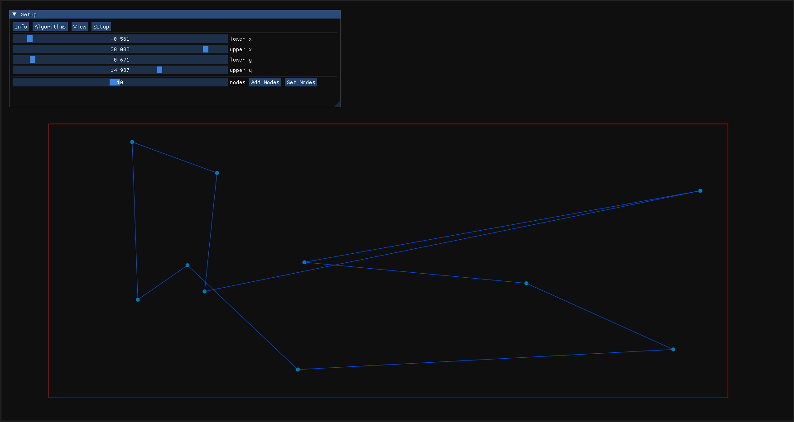
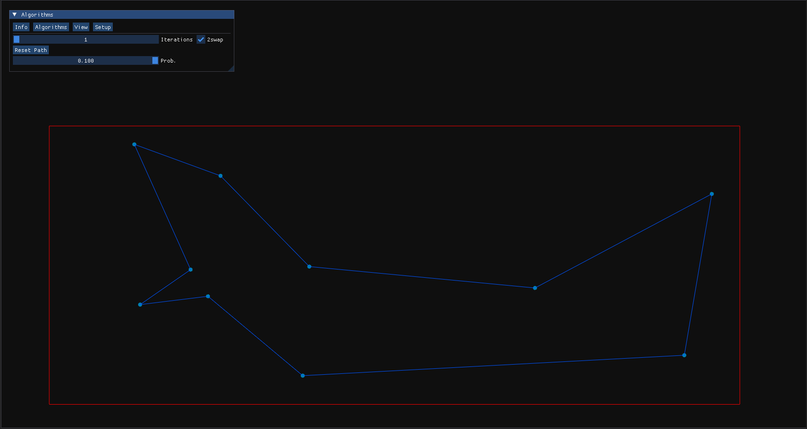
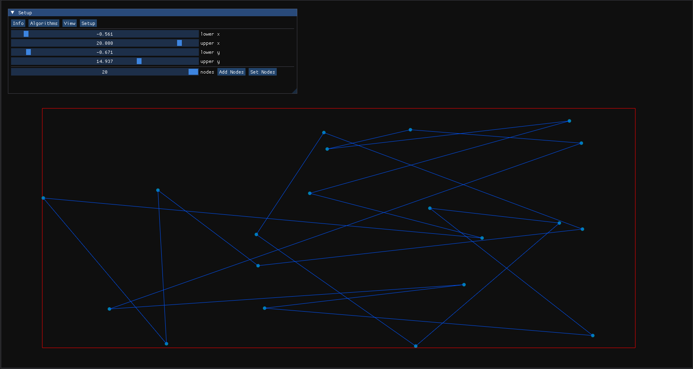
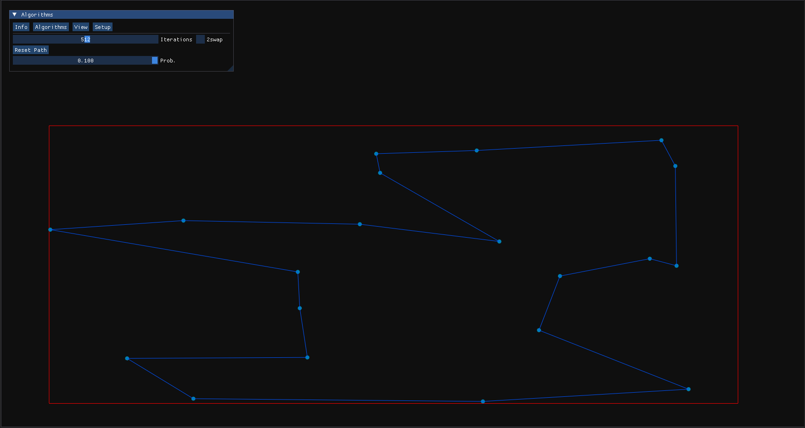
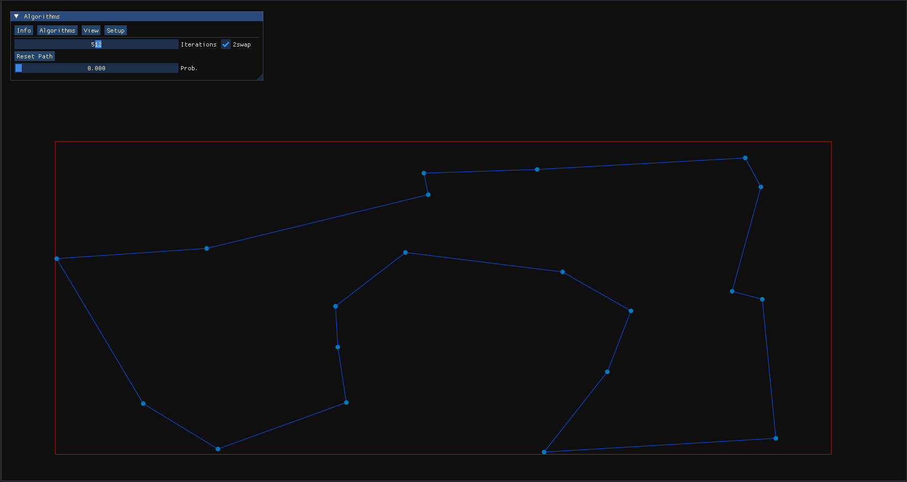
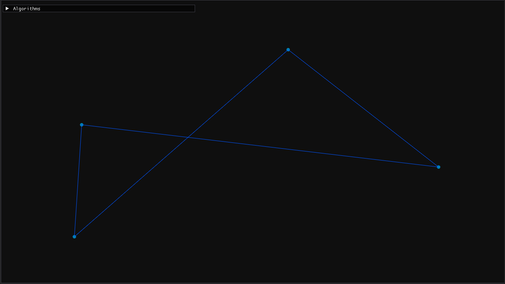
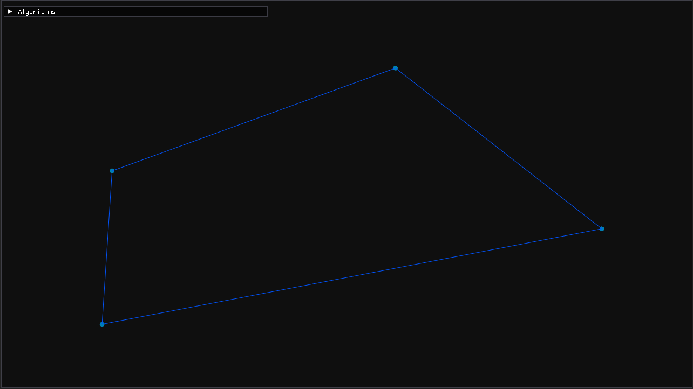

# Overview
This project brute forces the traveling salesman problem, visually showing the process utilizing imgui and GLFW.\

Small problem:\
\
Small problem solution:\
\

\
Large problem:\
\
Large problem solution:\
\
Better Large problem solution:\
\

# Build Instructions
This project uses meson and ninja. After these tools are installed, run the following to download, build, and run the app:
```
git clone https://github.com/morgandbusch/Traveling-Salesman-cpp.git &&
cd Traveling-Salesman-cpp/ &&
git submodule init &&
git submodule update &&
meson build &&
cd build &&
ninja app
./app
```

## Traveling salesman problem Overview
Given a set of random points, what s the shortest loop that visits each point at least once?\
This problem is NP-complete, meaning that not only can it not be solved in polynomial time, but any solution cannot be proven to be optimal without comparing every possible solution.\
A "good enough" solution can be found via local optimization. This program picks a random path. Then for each iteration, it will pick two segments between two pints and will swap them.
Ex: 


The to segments that are selected are:
    1. top-left to bottom-right
    2. top-right to bottom-left
These segments are then swapped to:
    1. top-left to bottom-left
    2. top-right to bottom-right


In this case, the path is improved. However, to avoid getting stuck in a local minimum, worse paths are accepted with a configurable probability.

# Program Features

- Info:
    - Show current and previous shortest path lengths
    - Reset current shortest path length
- Algorithms:
    - Iterations: How many swap iterations per frame will be calculated
    - 2swap: Check the box to start the random swap algorithm
    - Reset path: Resets the current path to the first path that was generated
    - Prob: Probability that a worse path is accepted
- View: Toggle visibility of
    - Nodes
    - Bounds of node generation
    - Current path
    - Best found path
    - Minimum Spanning Tree (For future Christofides algorithm implementation)
- Setup:
    - Change boundaries of where nodes can be generated
    - Add / Set number of nodes. These nodes are randomly placed within the set boundary


